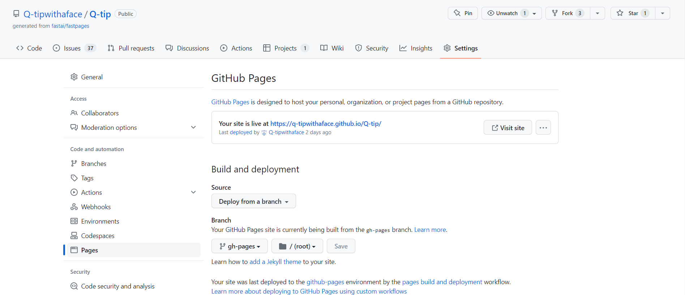

<html lang="en">
<head>
    
    <meta charset="UTF-8">
    <meta http-equiv="X-UA-Compatible" content="IE=edge">
    <meta name="viewport" content="width=device-width, initial-scale=1.0">
    <title>Learn GitHub pages!</title>
</head>
<body>
    

        

            <h2 style="background-color:rgb(0, 100, 200);">
GitHub pages!
</h2>
            

            <h3 style="background-color:rgb(150, 150, 150);">
What is Github pages?
</h3>
            

            
Github pages is a hosting service website that hosts files created from the given github repository. Github pages can be used by people like you and me to share and present their work for others to see. The websites created consists of files in the programming languages HTML, CSS, and JavaScript. Notice anything about those types of files? Those are the type of files that are used to build our code's frontend. This makes the purpose of Github pages to display and hold a users projects and for them to have access to their own website.

            

            

            

            <h3 style="background-color:rgb(150, 150, 150);">
How to set up Github pages!
</h3>
            

            
Github pages were designed to be simple so that it could be used by all so this is a quick and easy setup. You start by creating a new repository under your github account. You will then go into the setting's Pages/Build and Deployment/Source and change it to Deploy from a branch. You will them change Pages/Build and Deployment/Branch so that it selected to a publishing source. For a better step by step on how to do this, visit <a href="https://docs.github.com/en/pages/quickstart">this Github Doc</a>.

            

            

            

            <button onclick="githubFunction()" id="btn1">Read about Github Pages!</button>
            

            

            <h2 style="background-color:rgb(255, 255, 255);">
Fastpages!
</h2>
            

            <h3 style="background-color:rgb(150, 150, 150);">
What is fastpages?
</h3>
            

            
Fastpages is a blogging site that is designed to be easy to use in order to create blog posts. A fastpage is reliant on Github pages to host it as well as the Github actions to assist in the creation of the blog and its future changes. Fastpages is an easy to use blogging site but why do we use it for our blog posts? We use Fastpages because it contains Jupyter Notebooks. Fastpages with the help of Github Actions can convert a Jupyter Notebook under the files <code>/_notebook</code>, <code>/_posts</code>, and even <code>/_word</code> into a blog post. This automatically happens through the use of <a href="http://nbdev.fast.ai/index.html">nbdev</a>. This is why fastpages are easy to use for blogging and why the addition of Jupyter Notebooks is important.

            

            

            

            <h3 style="background-color:rgb(150, 150, 150);">
More about Jupyter Notebooks?
</h3>
            

            <dd>Jupyter Notebooks has the following features that can be useful when writing a blog.</dd>

            <dd>
                <ul>
                    <li>Hiding or showing code outputs</li>
                    

                    <li>Collapsable code cells</li>
                    

                </ul>
            </dd>
            

            

            <button onclick="fastpageFunction()" id="btn2">Read about Fastpages!</button>
            

            

            <h2 style="background-color:rgb(80, 195, 50);">
Conda Script!
</h2>
            

            <h3 style="background-color:rgb(150, 150, 150);">
What is Conda Script?
</h3>
            

            
Info about conda script.

            

            

            

            <button onclick="anacondaFunction()" id="btn3">Read about Conda Script!</button>

