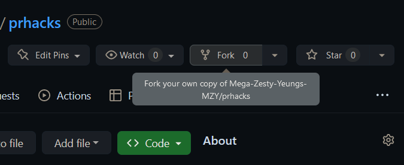
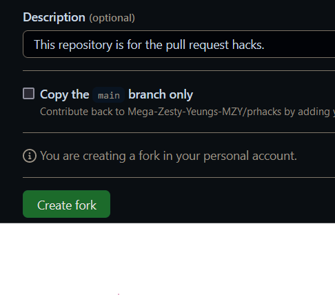
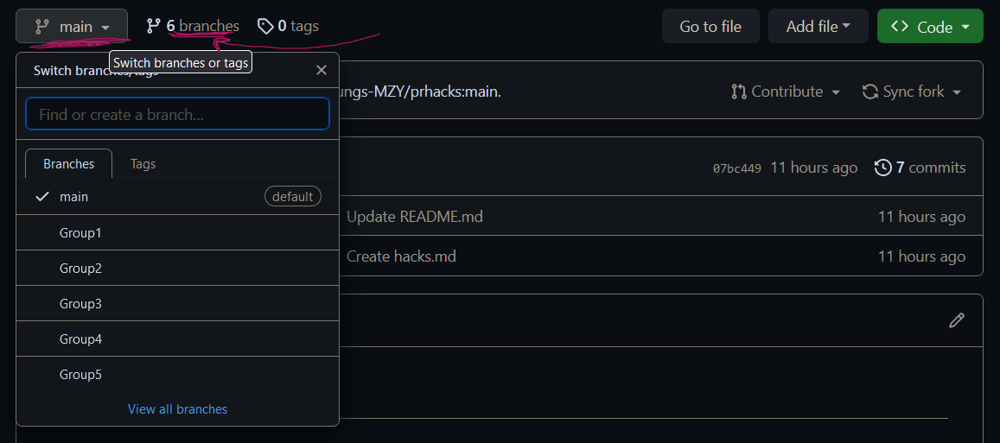
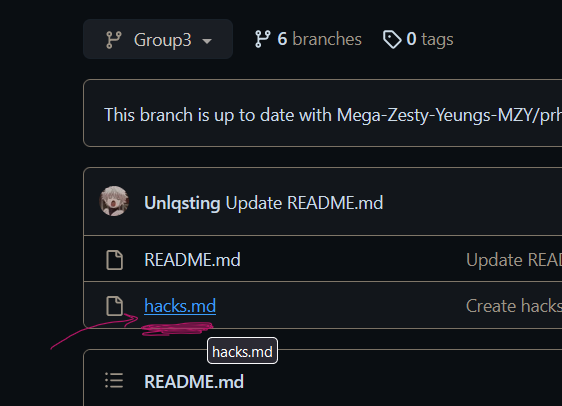
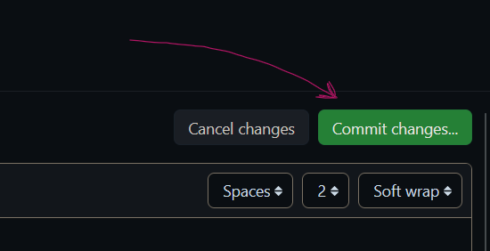
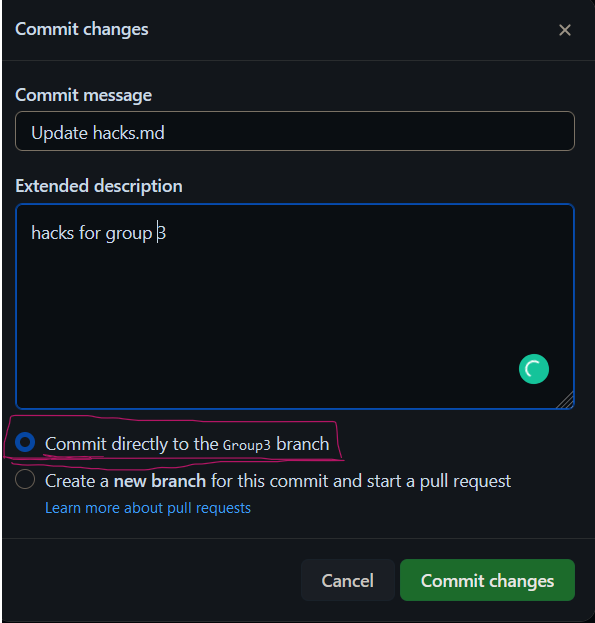
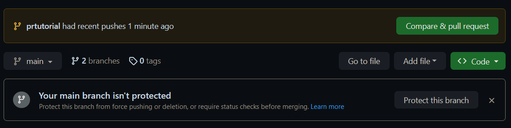
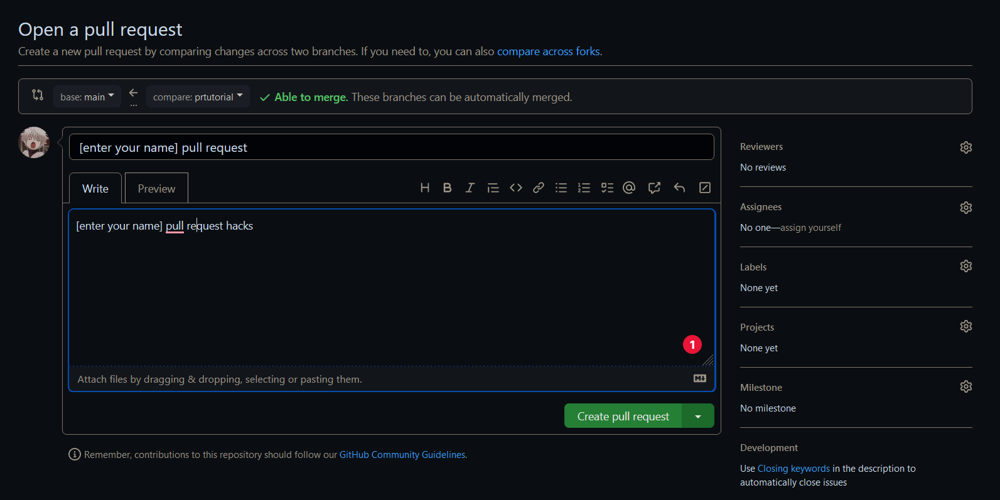
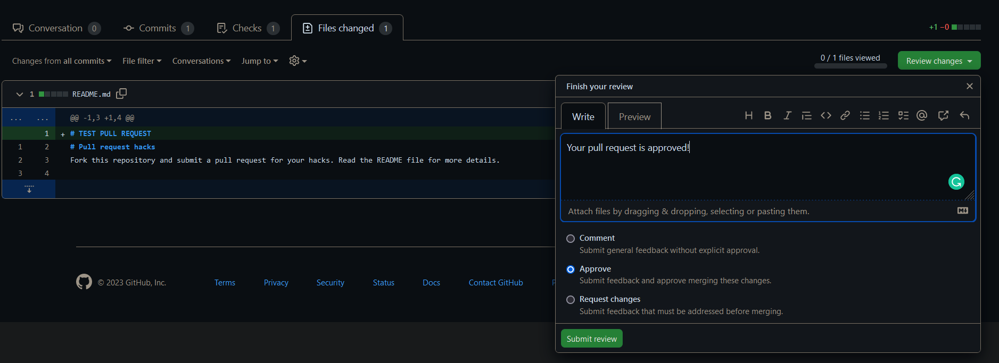

<head>
    <link rel="stylesheet" href="scss/pr2.css">
</head>

# Pull requests
### Step 1:

- Go to the repository you want to contribute to. Then click on the fork button on the top right corner of the page.

 

- make sure you uncheck 'copy main branch only'

### Step 2:
- Go to your profile and click on the repository you just forked.
> **There are many ways to make a pull request, but for simplicity we will do PR's on github**

### Step 3:
- Switch to the branch you want to edit (in this case switch to your groups branch)

- Go to the file you want to edit (make sure you clicked on the right branch)

- Edit the file (hacks.md) and commit the changes

> **You can now start the process of a pull request**

### Step 4:

- Go to the <a href="https://github.com/Mega-Zesty-Yeungs-MZY/prhacks">main repository</a> (the one you forked from)
- Click on the pull request button on the top left corner of the page.
- Click on the 'New pull request' button or the 'compare and pull request' button.

- Submit your pull request

- Wait for us to approve the PR (Below is how it looks from our side)

-----------------------------
<!-- ! second page -->
<head>
    <meta charset="UTF-8">
    <meta http-equiv="X-UA-Compatible" content="IE=edge">
    <meta name="viewport" content="width=device-width, initial-scale=1.0">
    <title>Pull requests</title>
    <link rel="stylesheet" href="scss/pullreq.css">
    
</head> 
<body>
    

        

            
<h1>Common questions:</h1>

        

        

            <!--  -->
            

                

                    <h2 id="q1">What are pull requests?</h2>
                    
Pull requests are a developer requesting the project to pull changes that you made to the repository fork.

                

                

                    <!--  -->
                    <h2 id="q2">What is the difference between 'pull' and 'push' requests?</h2>
                    
Pull requests are a 'request' for someone to pull your local changes. Push 'request' is a command. It tells github to upload your changes.

                

                

                    <!--  -->
                    <h2 id="q3">Why do we use pull requests?</h2>
                    
Pull requests help ensure that your code is reviewed before being pushed to the main codebase. This can help avoid bugs and other issues.

                

